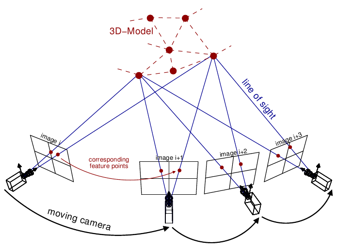
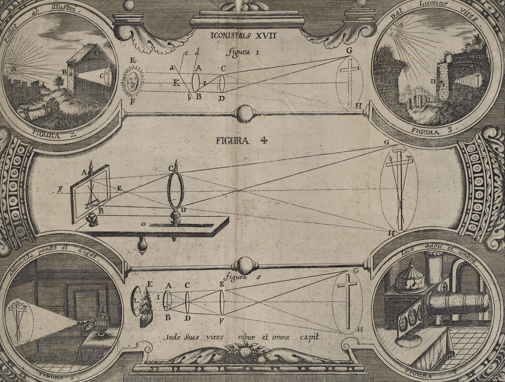

# Intro to Photogrammetry

Author: Gabriel Dunne  
email: [gabe@gabrieldunne.com](mailto:gabe@gabrieldunne.com)  
www: [gabrieldunne.com](http://gabrieldunne.com)  
twitter: [@gabrieldunne](https://twitter.com/gabrieldunne)  
ig: [@gabrieldunne](https://instagram.com/gabrieldunne)  

###### Headlands Bunker Scan (Dense Cloud with Image Planes), Agisoft Screenshot. Source: [Okaynokay, Twilight Engines](http://oknk.studio/twilightengines) 2019

## What is Photogrammetry?

Photogrammetry is the process of creating 3D objects from 2D photographs. The process can be used to scan anything from objects and people, to architecture, terrain and landscapes. There are various strategies you can use when taking photos to produce accurate models. This document includes photography techniques, ideal camera settings and lighting, photogrammetry software, and further resources to create 3D models from photos.

###### Structure from Motion ([SfM](https://en.wikipedia.org/wiki/Structure_from_motion)) photogrammetric principle. Source: [theia-sfm.org](http://theia-sfm.org/) 2016

### Definition

  **Photogrammetry** *[noun]* The science or technique for obtaining reliable information on the natural environment or physical objects by recording, measuring and interpreting photographic images.

  Greek:

  - *"photos"* (light)
  - *"gramma"* (something written or drawn)
  - *"metron"* (measure)

#### Typical Outputs

A map, a drawing, a 3D model of a real-world object, scene, or terrain.

#### Related fields

Remote Sensing, GIS, Stereoscopy

#### Main Tasks of Photogrammetry

  - To measure something without touching it
  - To measure something that may no longer exist, or may only exist in photographs
  - To measure something too large to measure with traditional methods, i.e., landscape, a megalithic structure
  - Quantitative data from photographs, the science of measuring in photos.

#### Comparison to Laser Scanning (LIDAR)

Laser scanning is great in cases where photogrammetric techniques often fail -- such as when objects have low texture, or shiny/reflective. However, laser scanning is expensive, time consuming, and can't be used with moving objects like Photogrammetry can. That said, Laser Scanning and Photogrammetry can be considered complimentary to eachother.

## Abridged Photogrammetry History

###### Illustration from Oculus artificialis teledioptricus sive Telescopium, Johann Zahn 1685, Source: [Public Domain](https://publicdomainreview.org/collections/images-from-johann-zahns-oculus-artificialis-1685/)

  - **1046 BC - 256 BC** Discovery and capture of natural optical phenomena. Perforated [gnomons](https://en.wikipedia.org/wiki/Gnomon) projecting a pinhole image of the sun were described in the Chinese Zhoubi Suanjing writings. Some ancient sightings of gods and spirits, especially in temple worship, are thought to possibly have been conjured up by means of camera obscura projections.
  - **300 BC** Geometry, perspective, [pinhole camera](https://en.wikipedia.org/wiki/Pinhole_camera) model — Euclid
  - **500 BC** [Camera Obscura](https://en.wikipedia.org/wiki/Camera_obscura). (500 BC in China, 350 BC Aristote, 1000 Al-Haytham, 1500 Léonard de Vinci)
  - **1430** Leon Battista Alberti, "Rerum Mathematicarum et Descriptio Urbis Romae". Developments of topographic mapping.
  - **1611** First documents of [Camera Lucida](https://en.wikipedia.org/wiki/Camera_lucida), eventually Patented in 1806 by William Hyde Wollaston.
  - **1836** [Daguerreotype](https://en.wikipedia.org/wiki/Daguerreotype), “gift to the world” from French Academy. First publicly available photographic process.
  - **1851** French officer Aime Laussedat develops the first photogrammetrical devices and methods.
  - **1858** The German architect A. Meydenbauer develops photogrammetrical techniques for the documentation of buildings.
  - **1866** The Viennese physicist Ernst Mach publishes the idea to use the [stereoscope](https://en.wikipedia.org/wiki/Stereoscope) to estimate volumetric measures.
  - **1885** The ancient ruins of [Persepolis](https://en.wikipedia.org/wiki/Persepolis) were the first archaeological object recorded photogrammetrically.
  - **1889** The first German manual of photogrammetry was published by C. Koppe.
  - **1893** Meydenbauer coined the word “Photogrammetry”.  
  - **1896** Eduard Gaston and Daniel Deville present the first stereoscopic instrument for vectorized mapping.
  - **1910** The ISP (International Society for Photogrammetry), now [ISPRS](https://www.isprs.org/), was founded  by E. Dolezal in Austria.
  - **1911** Aerial photogrammetry with rectified photographs by Theodor Scheimpflug.
  - **1924** Relative orientation determined by 6 points in overlapping images — von Gruber points.
  - **1957** Analytical plotter (Helava) - Image-map coordinate transformation by electronic computation & servocontrol.
  - **1964** First architectural tests with the new stereometric camera-system, which had been invented by Carl Zeiss, Oberkochen and Hans Foramitti, Vienna.
  - **1980** Due to improvements in computer hardware and software, digital photogrammetry gains more and more accessibility.
  - **2000's** Increasing accessibiulity of photography drones

# Image Capture Technique

###### Illustration from Oculus artificialis teledioptricus sive Telescopium, Johann Zahn 1685, Source: [Public Domain](https://publicdomainreview.org/collections/images-from-johann-zahns-oculus-artificialis-1685/)

## Camera

  - The best camera is the one you have that offers the sharpest image
  - RAW format if possible for best quality
  - Large storage if you take a lot of pictures, especially if you shoot in RAW
  - Pixel count is less important than physical optics (lens) quality and clarity.
  - Use a fixed focal length during the whole session. Avoid lens distortion. If you have a physical zoom, make sure it doesn't shift during your session.
  - ISO: As low as possible
  - Shutter speed: As fast as possible
  - Aperture: F8, higher is better
  - 50mm (35mm equiv) Optimal Focal Length 
  - White Balance: Manual
  - Bokeh is bad! Increase aperture for larger DOF for sharper photos.
  - Overcast/foggy/diffuse lighting is ideal — Soft shadows & low contrast for evenly lit images.

## Optional Equipment

  - Tripod/Monopod for stable shots
  - Color Checker For color accuracy
  - Scale Bar for measurement
  - Ground control points for picture overlap
  - Spray: Water or paint for reflective surfaces
  - Turntable for small objects in a controlled environment)
  - Drone for large swaths of terrain, autonomous aerial scans

## Guidelines

###### Source: [Agisoft Photoscan Manual](https://www.agisoft.com/pdf/photoscan-pro_1_4_en.pdf)

  - Don’t worry about taking too many photos. Remove bad ones later.
  - Use the highest resolution possible
  - Prioritize a sharp, focused image. Avoid movement, motion blur, or out of focus areas.
  - Use a remote trigger for your camera when possible for an even sharper image.
  - Enable GPS on your camera if supported (improves alignment in software)
  - Each point on the scene must be seen in at least TWO images, and you should aim for THREE. Optimal overlap is about 80%
  - Take a note of a measurement of an element in the scene, or include a ruler or measuring tool somewhere in the scan.  
  - Always physically move when taking photos. DO NOT just rotate.
  - Rotate the camera on both axis, not just one
  - Don’t change a rotational viewpoint more than 30 degrees in a series
  - Prioritize object texture.
  - Avoid plain/monotonous or glittering/reflective surfaces. 
  - Avoid harsh shadows or high contrast areas. These may be confused with geometry by the alignment software.
  - Avoid shiny, glittery surfaces.
  - Avoid anything with a [specular highlight](https://en.wikipedia.org/wiki/Specular_reflection) that changes as the camera view moves
  - Start with the entire scene or object, and gradually hone in on details
  - Complete loops. Go around objects and end up where you started
  - Pictures are processed in order, so stay organized
  - Don't just take one loop, take multiples from various angles
  - Turntable Method: Object moves, camera stays still
  - Walk-Around Method: Object stays still, camera moves
  - Go with your instincts, break rules, test ideas!

## Practice

###### Headlands Rock Scan, (Sparse Point Cloud). Agisoft Screenshot. Source: [Gabriel Dunne](http://gabrieldunne.com) 2019

The best way to learn is to practice. Here are some ideas for things to scan.

  - A rock
  - Statue or a monument
  - Building facade
  - Fire hydrant
  - A curb or urban object
  - A vehicle like a car or a bicycle or skateboard
  - Shoe
  - Handbag or backpack
  - Tunnel or some stairs
  - Room, interior scene
  - Building Exterior
  - A reflective surface, a mirror in a room (will break spectacularly!)
  - Someones head or body (they have to be still!)
  - An Insect
  - A plant
  - Food
  - Terrain with a Drone

## Photogrammatry Software

  - [AliceVision](https://alicevision.org)  - Free, Open Source
  - [COLMAP](https://colmap.github.io/index.html) - Free, Open Source
  - [Meshroom](https://alicevision.github.io/#meshroom) - Free, Open Source
  - [MicMac](https://micmac.ensg.eu/index.php/Accueil) - Free, Open Source
  - [Regard3D](http://www.regard3d.org/index.php) - Free, Open Source
  - [OpenMVG](https://qgis.org/en/site/) - Free, Open Source  
  - [VisualSFM](http://ccwu.me/vsfm/) - Free for Non profit & personal use
  - [Agisoft Metashape](https://www.agisoft.com) - Commercial
  - [RealityCapture](https://www.capturingreality.com/Home), Commercial
  - [Autodesk ReCap](https://www.autodesk.com/products/recap/overview), Commercial
  - [Bentley ContextCapture](https://www.bentley.com/en/products/brands/contextcapture), Commercial
  - [IMAGINE Photogrammetry](https://www.hexagongeospatial.com/products/power-portfolio/imagine-photogrammetry), Commercial
  - [iWitnessPRO](http://www.iwitnessphoto.com/), Commercial
  - [DroneDeploy](https://www.dronedeploy.com/), Commercial
  - [Pix4D](https://pix4d.com/), Commercial
  - [Photomodeler](https://www.photomodeler.com/index.html), Commercial
  - [3DF Zephyr](https://www.3dflow.net/), Commercial

## Free 3D Modeling, Mesh Manipulation Software Suggestions

  - [Meshlab](http://www.meshlab.net/), Free, Open Source
  - [Blender](https://www.blender.org/), Free, Open Source  
  - [Meshmixer](http://www.meshmixer.com/), Free

## Articles and References

###### Illustration from Oculus artificialis teledioptricus sive Telescopium, Johann Zahn 1685, Source: [Public Domain](https://publicdomainreview.org/collections/images-from-johann-zahns-oculus-artificialis-1685/)

These articles are for reference and educational use. I claim no ownership or rights to this material.

  - [3d Scan Anything using a Camera and Photogrammetry with Autodesk ReMake](./pdf/3D-Scan-Anything-Using-a-Camera-Photogrammetry-With-Autodesk-Remake.pdf)
  - [3D Scanning Class](./pdf/3D-Scanning-Class.pdf)
  - [3D Scanning Photogrammetry with a Rotating Platform](./pdf/3D-scanning-Photogrammetry-with-a-rotating-platform.pdf)
  - [3D Scan Anything Using Just a Camera](./pdf/3d-Scan-Anything-Using-Just-a-Camera.pdf)
  - [Photogrammetric Procedure for Modeling Castles and Ceramics](./pdf/Aaron_Pattee--Photogrammetric_Procedure_for_Modeling_Castles_and_Ceramics_2016_1.pdf)
  - [Agisoft - Basic Tutorial](./pdf/Agisoft-BASIC_TUTORIAL_FOR_AGISOFT_PHOTOSCAN_ENG.pdf)
  - [Agisoft - Making Models with Photogrammetry](./pdf/Agisoft-Making_Models_With_Photogrammetry_[Agisoft-Photoscan].pdf)
  - [Agisoft - 3D Model Reconstruction (Beginner)](./pdf/Agisoft-PS_1.0.0-Tutorial-BL-3D-model.pdf)
  - [Agisoft - 3D Model Reconstruction (Intermediate)](./pdf/Agisoft-PS_1.1-Tutorial-IL-Building.pdf)
  - [Agisoft - Orthomosaic and DEM Generation with Ground Control Points](./pdf/Agisoft-PS_1.3-Tutorial-BL-Orthophoto,DEM-GCPs.pdf)
  - [Agisoft - Creating Masks in Photoshop to Import in Photoscan](./pdf/Agisoft-TUTORIAL_CREATING_MASKS_IN_PHOTOSHOP_TO.pdf)
  - [Agisoft - Comparing Point Clouds from Photoscan Projects in Cloud Compare](./pdf/Agisoft-TUTORIAL_PHOTOSCAN_AND_CLOUD_COMPARE_ENG.pdf)
  - [Agisoft - Metashap Presentation](./pdf/Agisoft-metashape_presentation.pdf)
  - [Agisoft - PhotoScan Usermanual - Professional Edition, Version 1.4](./pdf/Agisoft-photoscan-pro_1_4_en.pdf)
  - [Applications of Projective Transformation for Stereo Photogrammetry](./pdf/Applications-of-projective-transformation-for-stereo-photogrammetry.pdf)
  - [Geomatic For Conservation: “the Shadow And The Reality” - Reading The Sperimental And Theoretic Efforts Of Worldwide Recognized Genius: Leon Battista Alberti](./pdf/Dezzi-Bardeschi-Geomatic-for-conservation_the-shadow-and-the-reality-reading-the-sperimental-and-theoretic-efforts-of-worldwide-recognized-genius.pdf)
  - [SAA Archaeological Record March 2016 - Drones in Archaeology](./pdf/Drones_in_Archaeology_Special_Issue_SAA_Record_March2016.pdf)
  - [Education In Photogrammetry (Laussedat, 1952)](./pdf/Education_In_Photogrammetry_Laussedat_1952_mar_21-26.pdf)
  - [Translation of “Zur Ermittlung eines Objektes aus zwei Perspektiven mit innerer Orientierung” by Erwin Kruppa (1913)](./pdf/Erwin-Kruppa.pdf)
  - [Free Photogrammetry on Mac OS: From Photos to 3D Models](./pdf/Free-Photogrammetry-on-Mac-OS-From-Photos-to-3D-Mo.pdf)
  - [Fundamentals of Photogrammetry](./pdf/Fundamentals_of_Photogrammetry.pdf)
  - [Fundamentals of Photogrammetry, URP, KUET](./pdf/Fundamentals_of_Photogrammetry_2.pdf)
  - [Historical Survey of Computer Vision](./pdf/Historical_Survey_of_Computer_Vision.pdf)
  - [History of Photrogrammetry (Dermanis)](./pdf/History_of_Photogrammetry--Dermanis.pdf)
  - [History of Photogrammetry](./pdf/History_of_Photogrammetry.pdf)
  - [Image Capture Tips: Equipment and Shooting Scenarios](./pdf/Image-Capture-Tips_Equipment-and-Shooting-Scenarios.pdf)
  - [Introduction To Photogrammetry](./pdf/Introduction_To_Photogrammetry.pdf)
  - [Elements of Analytical Photogrammetry](./pdf/Elements_of_Analytical_Photogrammetry.pdf)
  - [Everything You need to Know about Photogrammetry (I Hope), Joseph Azzam](./pdf/Joseph_Azzam_-_Everything_you_need_to_Know_about_Photogrammetry_i-hope.pdf)
  - [Authenticity and Restoration: The Benefits of Historical Studies on Re-Examining the Implemented Restorations in Persepolis](./pdf/Persopolis.pdf)
  - [Photography Class by Audrey Lee Love](./pdf/Photography-Class.pdf)
  - [Archival 3D Photography, Michael Ashley](./pdf/SHN-Archival-3D-Photography-CoDA-Ashley.pdf)
  - [Photogrammetric Surveys](./pdf/Photogrammetric-Surveys.pdf)  
  - [From Photos to Models, Adam Barnes, Katie Simon, Adam Wiewel](./pdf/SPARC_Photogrammetry.pdf)
  - [Teachings of Basic Photogrammetry, Reynold E. Ask, 1943](./pdf/Teachings_of_Basic_Photogrammetry_1943_jun_86-100.pdf)
  - [The Art of Photogrammetry: How To Take Your Photos, Brandon Blizard, Tested, 2014](./pdf/The_Art_of_Photogrammetry-How_To_Take_Your_Photos_-_Tested.pdf)
  - [The Art of Photogrammetry: Introduction to Software and Hardware, Brandon Blizard, Tested, 2014](./pdf/The_Art_of_Photogrammetry-Introduction_to_Software_and_Hardware_-_Tested.pdf)
  - [The Poor Man’s Guide to Photogrammetry, BBB3VIZ 2018](./pdf/The_poor_mans_guide_to_photogrammetry.pdf)
  - [Unity Photogrammetry Workflow, S. Lachambre, S. Lagarde, C. Jover 2017](./pdf/Unity-Photogrammetry-Workflow_2017-07_v2.pdf)
  - [Using Computer Vision Photogrammetry To Record And Analyze Underwater Shipwreck Sites, Kotaro Yamafune, 2016](./pdf/Using-ComputerVision-Photogrammetry_YAMAFUNE-DISSERTATION-2016.pdf)

## Emergence of Mathematical Solutions related to Photogrammetry

- [3D Pose Problem](https://en.wikipedia.org/wiki/3D_pose_estimation), [\[2\]](http://www.ignaciomellado.es/blog/The-relative-pose-problem-A-chronology)
- [Epipolar geometry](https://en.wikipedia.org/wiki/Epipolar_geometry)
- [Trifocal Tensor](https://en.wikipedia.org/wiki/Trifocal_tensor)
- [Motion Estimation](https://en.wikipedia.org/wiki/Motion_estimation), [\[2\]](./pdf/Erwin-Kruppa.pdf)
- [3D Reconstruction from Multiple Images](https://en.wikipedia.org/wiki/3D_reconstruction_from_multiple_images), [\[2\]](https://en.wikipedia.org/wiki/Rephotography) 
- [3D reconstruction from uncalibrated images & projective reconstruction](https://en.wikipedia.org/wiki/3D_reconstruction)
- [Camera self-calibration](https://en.wikipedia.org/wiki/Camera_auto-calibration)

---

&copy; [Gabriel Dunne](http://gabrieldunne.com), 2019
